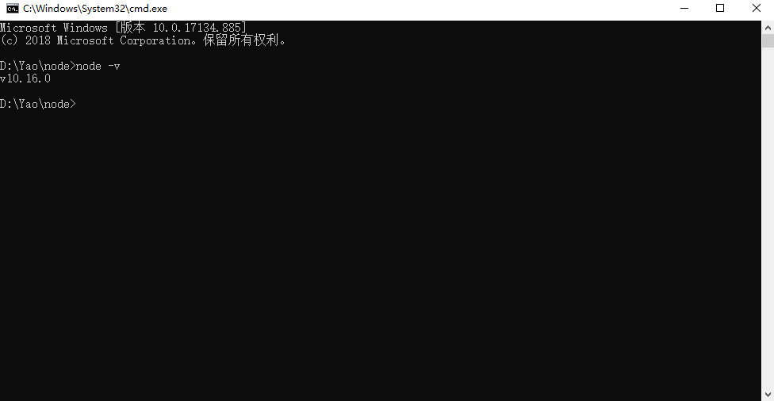
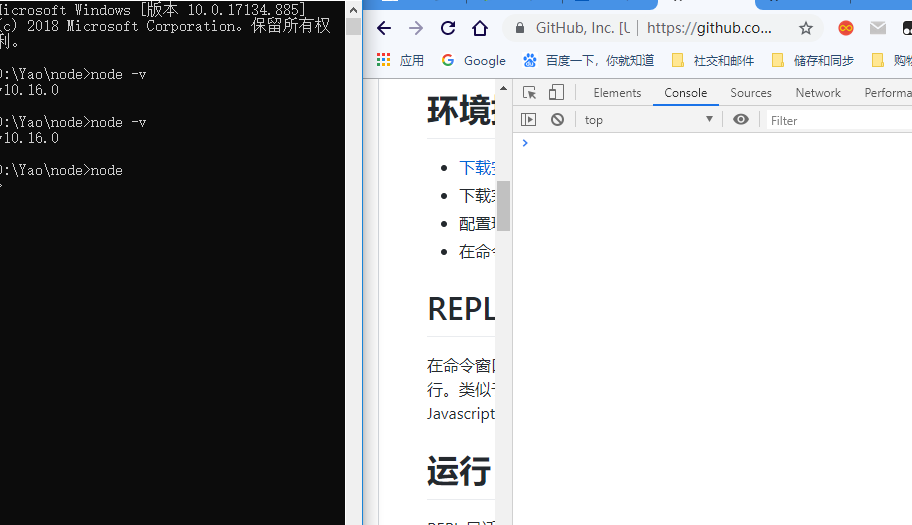
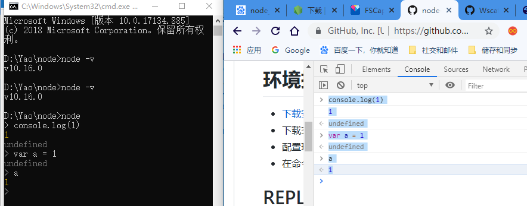

# Node详细文档

[Node文档](https://github.com/Wscats/node-tutorial)

# 第一门后端语言

系统环境WAMP (Win,Apache,Mysql,PHP)

PHP后端语言

# Node介绍

Node的地位是跟PHP相似的

Node 是一个服务器端 JavaScript 解释器

Node是搞后端的，Node用JS写的

前端在开发的时候，你会用HTML,CSS,JS写好页面运行浏览器(Chrome)

Node其实就是把谷歌浏览器的引擎拿了出来，安装在系统上

你要跑一段JS，必须满足两个条件(你需要一份HTML，还要HTML把你这个JS引进来)

Node就是 想摆脱HTML和浏览器环境，独立生存。

那一天浏览器崩了，我们三兄弟也可以生存，把浏览器做了，把它的心脏（浏览器引擎）=》Node

Node诞生的十个年头，为了做后台，打PHP，压JAVA

# 优点

- Node.js 使用了一个事件驱动、非阻塞式 I/O 的模型，使其轻量又高效

# 安装

安装Node环境，其实就是把浏览器心脏拿出来u重新安装在电脑上

[Node官网下载地址](http://nodejs.cn/download/)

如果安装成功，你可以执行一下命令检查是否安装成功

```bash
node -v 
# 10.16版本
```




# 编写第一个Node程序



在以前我们运行JS代码，一般是用HTML把写好的JS引进来，然后用浏览器打开执行

所以我们Node也遵循这个方法，我们一般不会直接在控制台里面写这个代码，我们会写好一份JS代码 ，再交给 控制台运行



我们一般运行Node的JS会在命令行里面用Node加上文件的名字(可省略后缀)


```bash
node index
node index.js
```

Node其实就是JS把浏览器的控制台抽离出来，单独一个环境运行JS，而不需要借助浏览器环境和另外两门语言的协助(html,css)

既然Node没有HTML和CSS的协助，它也丧失了（DOM和BOM的能力）

Node没有所有的DOM和BOM，但是除了这两个之外JS本身应该有的它都有，JS真正变成一个最单纯的后端语言，而负责前端的JS其实就是比它多了和html和css交互的DOM和BOM


# REPL(交互式解释器)

跟你在浏览器控制台打代码没什么区别，唯独背景色是黑色区别于浏览器的白色

```js
var offset = 0;
setInterval(() => {
    console.log(offset++);
}, 1000)
```

暂停你的代码
```js
Ctrl+C
```

# Node.js 模块

模块系统是 Node.js 最基本也是最常用的。一般情况模块可分为四类：

- 原生模块
- 文件模块
- 第三方模块
- 自定义模块

## 前端的模块化

```html
<!-- 封装好常用的BOM和DOM的功能，还有节点的增删改善 -->
<script src="jquery.js"></script>
<!-- 专门去写网页的一些交互逻辑，比如ajax数据请求 -->
<script src="index.js"></script>
<!-- 轮播图，滑块容器 -->
<script src="swiper.js"></script>
```


如果你不把这个JS分成一段段引入的话，全部逻辑写在同一份JS里面，那么首先维护成本很高，并且可识别度低

## 后端的模块化

html和css 还有bom和dom丢失了

利用`require`这个关键词去引入其他JS（模块），require.js

导入
```js
require()
```
导出
```js
module.exports = xxx
```

比如我们这里写入个例子，我们新建一份`index.js`，这是主入口，主逻辑文件，我们不可能逻辑写在这份文件里面，所以我们需要其他JS去辅助完成主要的功能，所以我把加法和减法分配给jquery去编写，此时jquery在后端就相当于一个独立模块，需要用require去吸收其他模块的功能，增强自身的能力
```js
// 导入建议写在最上面
// 把jquery的代码引入进来
var obj = require('./jquery.js')
// console.log(arr)
// console.log(arr[0](9, 16))
console.log(obj)
console.log(obj.plus(99, 55))
console.log(obj.sub(99, 55))
```
以下就是一份jquery.js文件，里面封装好了加法和减法，但是由于它是高度独立的模块，无法与index.js做关联，需要用关键词module.exports把该模块导出，方便其他模块调用
```js
function plus(a, b) {
    return a + b
}

function sub(a, b) {
    return a - b
}

// 导出建议写在代码最后一行
// 先把函数导出
// 导出一个函数
// module.exports = plus
// 导出一个对象，建议导出对象，面向对象编程
module.exports = { plus, sub }
// 导出一个数组
// module.exports = [plus]
```