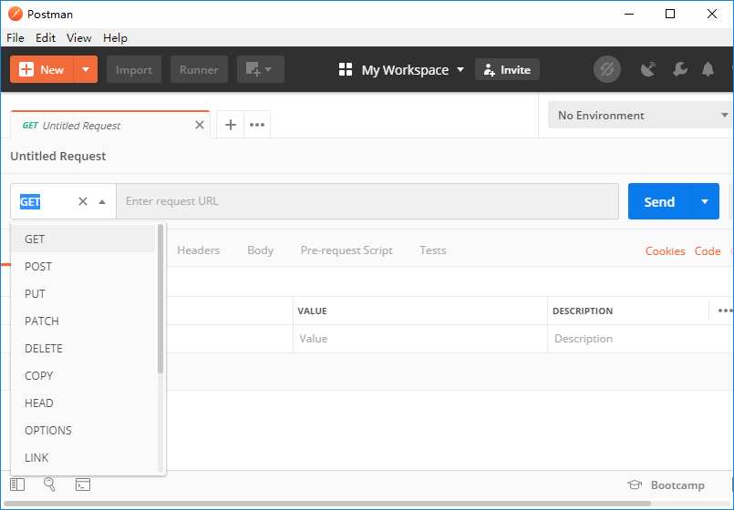

# http -> express

http是原生模块，express是帮你做了http添砖加瓦，做完了一个后端该有的一个框架

express前端遇到第一个框架，它不是前端框架，它要活在node里面，所以它其实后端框架

框架->图纸  库->工具

express    jquery

express提供思路 不提供方法

jquery提供方法 不提供思路

# express

详细的API

[官方中文文档](http://www.expressjs.com.cn/)

[Express NPM文档](https://www.npmjs.com/package/express)

express也是一个第三方模块，它不是我写的，第三方写的

npm搞回来

```bash
npm install express --save-dev
```

- 加载模块
```js
var express = require('express');
```

- 初始化express，让诞生第一个项目的对象

```js
const app = express()
```

- 后端路由

定义一个路由

发送一个get请求: http://localhost:12345/home

发送一个post请求: http://localhost:12345/setting

支持链式调用
```js
app.get('/home', (req, res) => res.send('Hello World!'))
app.post('/setting', (req, res) => res.send('Hello World!'))
// 监听一个端口
app.listen(12345)
```

如果一个后端，你要给我一个接口


知道用什么请求方法，请求的路径和端口，请求的参数，响应的数据结构

# 接口文档

|协议|域名|端口|路由|参数|类型|
|-|-|-|-|-|-|
|http|localhost|12345|/home|?name=xxx|GET|

示例接口


# Postman

[Postman官网下载](https://www.getpostman.com/downloads/)



你在开发的时候先拿到后端接口，用postman测试该接口是否可行，如果可行，记录下来用于开发，否则去找后端商量问题所在，在用于前端开发

postman不会跨域，它其实是基于类似node这种后端平台开发的

你再去用ajax请求解决跨域问题去后端拿对应的数据

