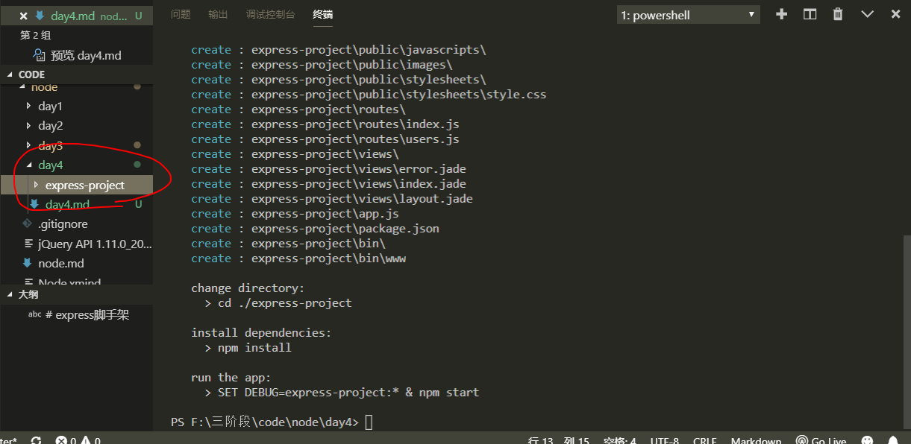
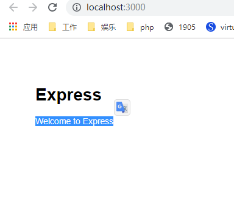

# express脚手架

express在开发这里面，官方提供一个一体化的平台，是因为人家可以定制化，一键构建最简单后端开发模型

由于成本上的问题，框架给你提供了一个脚手架（集成环境）环境开发

全局安装脚手架的指令
```bash
npm install -g express-generator@4
```
如果安装成功，会在全局拥有一个express的命令
```bash
# 创建一个项目
express 路径
express ./express-project
```


进入express-project目录安装依赖
```bash
cd express-project
npm install
# 建议使用淘宝镜像
cnpm install
```
安装依赖成功
```bash
npm run start
# start命令的简写
npm start
```
在浏览器访问http://localhost:3000，如果成功就会看到以下网页内容



# 目录结构

- bin 启动文件 node ./bin/www 里面用了http模块实现了服务器，所以express服务器本质是建立在http原生模块上，可以更改端口号
- node_modules 项目的其他依赖
- public 静态资源文件夹(里面会放前端的东西，比如页面，JS，样式，HTML,CSS,JS,IMG)
- routes 路由文件夹 类似处理这种app.post app.get
- views 视图层
- app.js 主逻辑文件，一般来说改动会比较少，它是配合路由更改
- package.json 项目描述文件


我们以前所有的项目都是前后端分离，但是express前后端一体化

```jade
doctype html
html
  head
    title= title
    link(rel='stylesheet', href='/stylesheets/style.css')
  body
    block content
```

scss是css的预编译语言，最终还是生成css
jade是html的预编译语言，最终还是生成html

typescript-es6->js


html5语义化


# app.js

app.js是为./bin/www服务的
```js
// 创建错误 404,502错误
var createError = require('http-errors');
var express = require('express');
// 是node的原生模块
var path = require('path');
// 解析cookie的
var cookieParser = require('cookie-parser');
// 打印的模块 打印一些请求结果在终端上 打印日志
var logger = require('morgan');

// 路由
var indexRouter = require('./routes/index');
var usersRouter = require('./routes/users');

var app = express();


// 中间件
// view engine setup
// 设置视图文件夹
app.set('views', path.join(__dirname, 'views'));
// 设置html预编译语言为jade，还有其他语言的 sass less
app.set('view engine', 'jade');

app.use(logger('dev'));
app.use(express.json());
app.use(express.urlencoded({ extended: false }));
app.use(cookieParser());
app.use(express.static(path.join(__dirname, 'public')));

app.use('/', indexRouter);
app.use('/users', usersRouter);

// catch 404 and forward to error handler
app.use(function(req, res, next) {
  next(createError(404));
});

// error handler
app.use(function(err, req, res, next) {
  // set locals, only providing error in development
  res.locals.message = err.message;
  res.locals.error = req.app.get('env') === 'development' ? err : {};

  // render the error page
  res.status(err.status || 500);
  res.render('error');
});

module.exports = app;

```

# path

path是原生模块，用于拼接路径，[path官方文档](http://nodejs.cn/api/path.html#path_path_join_paths)

```js
var path = require('path');
let p = path.join('/foo', 'bar', 'baz/asdf', 'abc', './');
console.log(p)
path.join(__dirname, 'views')
```

# __dirname

当前模块的目录名

[__dirname](http://nodejs.cn/api/globals.html)

返回一个绝对路径
```bash
F:\三阶段\code\node\day1\原生模块\path\foo\bar\baz\asdf\abc\
```